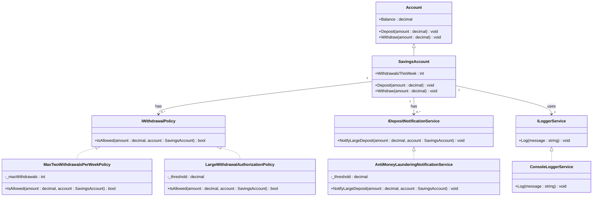

# Punto 4 - Caja de Ahorros con Políticas y Notificaciones

## 📌 Descripción del problema

Se parte de un módulo de caja de ahorros con las operaciones básicas:

- `depositar(dinero)`
- `retirar(dinero)`
- `saldo() : dinero`

Este módulo funciona correctamente, pero surgen **nuevos requisitos**:

1. **No más de dos retiros por semana**.
2. **Retiros mayores a $10X requieren autorización**.
3. **Depósitos mayores a $5X deben notificarse al área de control de lavado de dinero**.

---

## 🎯 Solución propuesta

Se aplicaron principios **SOLID** y se refactorizó el diseño:

- **Single Responsibility (SRP):**
  - Cada política de retiro (`IWithdrawalPolicy`) valida una regla específica.
  - Cada servicio de notificación (`IDepositNotificationService`) gestiona una acción concreta (ej. AML).
  - El `ILoggerService` centraliza el manejo de logs.

- **Open/Closed (OCP):**
  - Se pueden agregar nuevas políticas de retiro o notificación de depósitos sin modificar las clases existentes.

- **Liskov Substitution (LSP):**
  - `SavingsAccount` hereda de `Account` y respeta el comportamiento esperado de una cuenta.

- **Interface Segregation (ISP):**
  - Interfaces pequeñas y específicas: `IWithdrawalPolicy`, `IDepositNotificationService`, `ILoggerService`.

- **Dependency Inversion (DIP):**
  - `SavingsAccount` depende de **abstracciones**, no de implementaciones concretas.
  - Ejemplo: recibe listas de `IWithdrawalPolicy`, `IDepositNotificationService` y un `ILoggerService`.

---

## 🏗️ Diagrama de clases



---

## 📂 Estructura del proyecto

```
.
├── Program.cs
└── src
    ├── Account.cs
    ├── SavingsAccount.cs
    ├── Policies
    │   ├── IWithdrawalPolicy.cs
    │   ├── LargeWithdrawalAuthorizationPolicy.cs
    │   └── MaxTwoWithdrawalsPerWeekPolicy.cs
    └── Services
        ├── AntiMoneyLaunderingNotificationService.cs
        ├── IDepositNotificationService.cs
        ├── ILoggerService.cs
        └── ConsoleLoggerService.cs
```

---

## 🚀 Ejemplo de uso

```csharp
using point_4.src;
using point_4.src.Policies;
using point_4.src.Services;

class Program
{
    static void Main()
    {
        ILoggerService logger = new ConsoleLoggerService();

        var withdrawalPolicies = new List<IWithdrawalPolicy>
        {
            new MaxTwoWithdrawalsPerWeekPolicy(2),
            new LargeWithdrawalAuthorizationPolicy(100m) // $10X
        };

        var depositServices = new List<IDepositNotificationService>
        {
            new AntiMoneyLaunderingNotificationService(50m, logger) // $5X
        };

        var account = new SavingsAccount(200m, withdrawalPolicies, depositServices, logger);

        account.Deposit(60m);    // dispara AML
        account.Withdraw(30m);   // OK
        account.Withdraw(30m);   // OK
        account.Withdraw(30m);   // rechazado (límite semanal)
        account.Withdraw(150m);  // rechazado (requiere autorización)
    }
}
```

---

## ✅ Beneficios del diseño

- **Escalabilidad:** nuevas reglas o servicios se agregan sin modificar código existente.
- **Mantenibilidad:** responsabilidades separadas, fácil de probar y depurar.
- **Flexibilidad:** umbrales de políticas configurables en tiempo de construcción.
- **Cumplimiento de SOLID:** diseño robusto y extensible.
