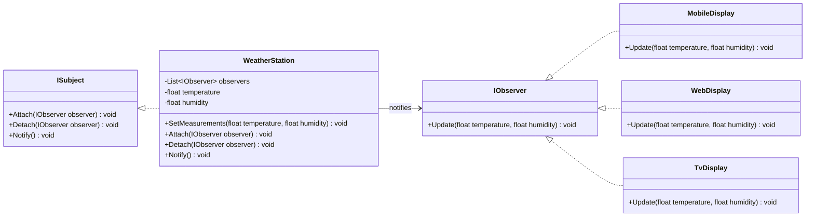

# 🌦️ Observer Pattern - Weather Station Example

## 📖 Descripción

Este proyecto implementa el **patrón de diseño comportamental Observer** en **.NET**.
Una **Estación Meteorológica (WeatherStation)** mantiene el estado del clima (temperatura y humedad).
Varias **pantallas** (`MobileDisplay`, `WebDisplay`, `TvDisplay`) se **suscriben** a la estación y son notificadas automáticamente cuando cambia la temperatura o la humedad.

Este es un caso clásico del **patrón Observer**, donde se establece una relación **uno-a-muchos** entre un objeto central y múltiples dependientes.

---

## 📂 Estructura del proyecto

```
observer/
├── Program.cs
└── src/
    ├── Interfaces/
    │   ├── IObserver.cs
    │   └── ISubject.cs
    ├── Subjects/
    │   └── WeatherStation.cs
    └── Observers/
        ├── MobileDisplay.cs
        ├── WebDisplay.cs
        └── TvDisplay.cs
```

- **Interfaces**
  Contiene `IObserver` y `ISubject`, que definen los contratos del patrón.
- **Subjects**
  Contiene `WeatherStation`, que mantiene el estado del clima y notifica a los observadores.
- **Observers**
  Contiene las diferentes pantallas (`MobileDisplay`, `WebDisplay`, `TvDisplay`) que reaccionan a los cambios.

---

## 📜 Diagrama de clases



---

## 🚀 Ejecución

1. Clona el repositorio o copia el código en tu máquina.
2. Entra en la carpeta raíz del proyecto (`observer/`).
3. Ejecuta el programa:

```bash
dotnet run
```

---

## ✅ Ejemplo de salida

```
[Mobile Display] Temperature: 25°C, Humidity: 60%
[Web Display] Temperature: 25°C, Humidity: 60%
[TV Display] Temperature: 25°C, Humidity: 60%
[Mobile Display] Temperature: 30.5°C, Humidity: 55%
[Web Display] Temperature: 30.5°C, Humidity: 55%
[TV Display] Temperature: 30.5°C, Humidity: 55%
```

---

## 🎯 Beneficios del patrón Observer

- **Desacoplamiento**: el `WeatherStation` no necesita conocer detalles de cada pantalla.
- **Flexibilidad**: se pueden agregar o eliminar observadores sin modificar la estación.
- **Escalabilidad**: múltiples observadores reaccionan a los cambios en tiempo real.
