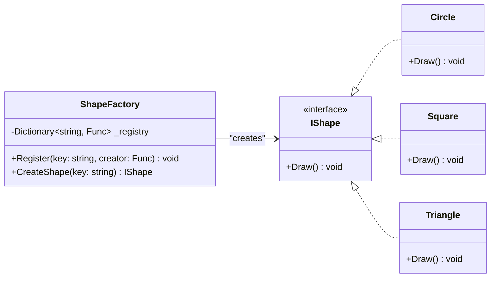

# 🏭 Factory Pattern in .NET

This project demonstrates the **Factory Method Pattern** using geometric shapes (`Circle`, `Square`, `Triangle`).
The goal is to decouple the client code from concrete implementations, following **SOLID principles**.

---

## 📂 Project Structure

```
factory/
├── Program.cs
└── src/
    ├── Interfaces/
    │   └── IShape.cs
    ├── Models/
    │   ├── Circle.cs
    │   ├── Square.cs
    │   └── Triangle.cs
    └── Factory/
        └── ShapeFactory.cs
```

---

## 🧩 Components

### 🔹 IShape (Interface)

Defines the common contract for all shapes:

```csharp
public interface IShape
{
    void Draw();
}
```

### 🔹 Models (Concrete Implementations)

- **Circle**
- **Square**
- **Triangle**

Each implements `IShape` and provides its own `Draw()` behavior.

### 🔹 ShapeFactory

Centralized factory responsible for creating `IShape` objects.
Uses a **registry (Dictionary)** so that new shapes can be added without modifying the factory itself (**Open/Closed Principle**).

```csharp
public static class ShapeFactory
{
    private static readonly Dictionary<string, Func<IShape>> _registry = new();

    public static void Register(string key, Func<IShape> creator)
    {
        if (!_registry.ContainsKey(key.ToLower()))
        {
            _registry[key.ToLower()] = creator;
        }
    }

    public static IShape CreateShape(string key)
    {
        if (_registry.TryGetValue(key.ToLower(), out var creator))
        {
            return creator();
        }
        throw new ArgumentException("Invalid shape type");
    }
}
```

---

## 📊 Class Diagram



---

## ▶️ Usage

Example in `Program.cs`:

```csharp
using factory.src.Factory;
using factory.src.Interfaces;
using factory.src.Models;

class Program
{
    static void Main(string[] args)
    {
        // Register available shapes
        ShapeFactory.Register("circle", () => new Circle());
        ShapeFactory.Register("square", () => new Square());
        ShapeFactory.Register("triangle", () => new Triangle());

        IShape shape1 = ShapeFactory.CreateShape("circle");
        shape1.Draw();

        IShape shape2 = ShapeFactory.CreateShape("square");
        shape2.Draw();

        IShape shape3 = ShapeFactory.CreateShape("triangle");
        shape3.Draw();
    }
}
```

### ✅ Output:

```
⚪ Drawing a Circle
⬜ Drawing a Square
🔺 Drawing a Triangle
```

---

## 📌 How it follows SOLID

- **S (Single Responsibility)**: Each shape knows only how to draw itself. The factory only manages object creation.
- **O (Open/Closed)**: New shapes can be added without changing the factory logic (just register them).
- **L (Liskov Substitution)**: Any shape can be replaced with another since they all implement `IShape`.
- **I (Interface Segregation)**: `IShape` only forces classes to implement `Draw()`, nothing else.
- **D (Dependency Inversion)**: The client depends on the abstraction (`IShape`), not concrete classes.

---

## 🚀 How to Run

```bash
cd factory
dotnet run
```
