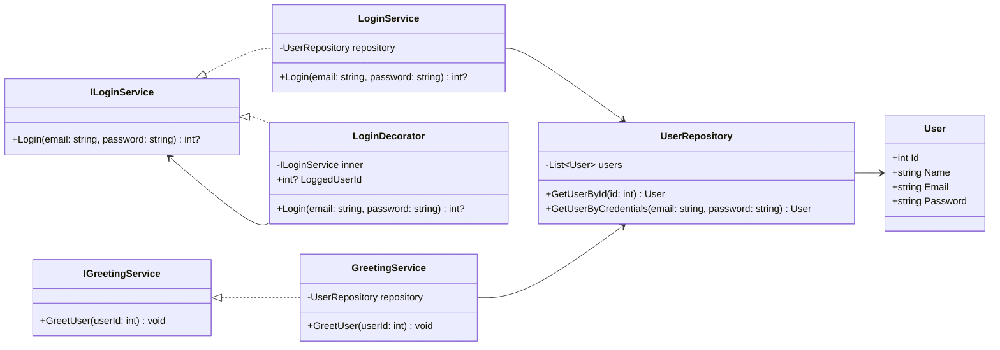

# Decorator Pattern Example in .NET

This project demonstrates the **Structural Design Pattern - Decorator** in **.NET** through a simple login and greeting simulation.

The **Decorator** pattern allows you to dynamically add responsibilities to objects without modifying their base code. In this case, the decorator is used to capture the logged-in user ID and pass it to a greeting service.

---

## 📂 Project Structure

```
decorator/
├── Program.cs
└── src/
    ├── Interfaces/
    │   ├── ILoginService.cs
    │   └── IGreetingService.cs
    ├── Models/
    │   └── User.cs
    ├── Services/
    │   ├── LoginService.cs
    │   ├── GreetingService.cs
    │   └── UserRepository.cs
    ├── Decorators/
    │   └── LoginDecorator.cs
    └── Data/
        └── users.json
```

---

## ⚙️ How It Works

1. **User data** is stored in `users.json`.
2. The system simulates a **login** using hardcoded credentials.
3. The **LoginDecorator** wraps the base login service and captures the `UserId`.
4. The `UserId` is then passed to the **GreetingService**, which looks up the user in the JSON file and prints a greeting.

---

## 📐 Class Diagram



---

## ▶️ Running the Project

1. Clone the repository or copy the folder structure.
2. Make sure you have **.NET 8 SDK** installed.
3. Navigate to the `decorator/` folder and run:

```bash
dotnet run
```

---

## 📋 Example Output

```
[Decorator] User logged with ID: 2
Hello, Bob! Welcome back.
```

---

## ✅ Advantages of Using Decorator

- Adds new behavior without modifying existing classes.
- Promotes **Open/Closed Principle** from SOLID.
- Behavior can be combined dynamically at runtime.

---

## 📌 Notes

- Users are stored in a simple JSON file (`users.json`).
- Credentials are simulated inside `Program.cs` for demonstration.
- You can easily extend this project by adding more decorators (e.g., logging, notifications).
